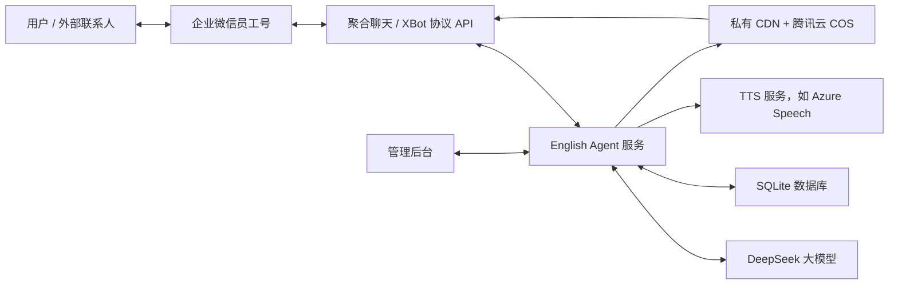

# 企微英语知识订阅 Agent 项目说明

更新日期：2026-06-25

## 1. 项目定位

本项目是一个面向企业微信私域场景的英语知识点订阅 Agent。

第一阶段目标不是做完整在线教育系统，而是先跑通一个可验证的 MVP：

- 用户添加一个企业微信员工账号；
- 系统自动识别并建立订阅关系；
- 每天向用户推送个性化英语知识点；
- 用户可以通过纯文本与 Agent 做简单互动；
- 后台可以配置推送规则、知识库、提示词和语音策略；
- 后续逐步扩展测评、付费、群运营、人工接管、多 Agent 等能力。

核心产品形态可以理解为：一个“英语知识点订阅型数字员工”。

## 2. 当前 MVP 范围

### 已纳入第一阶段

- 企业微信员工账号承接用户消息；
- 使用聚合聊天 / XBot 类供应商 API 实现消息收发；
- 用户添加或发送关键词后自动订阅；
- 每日知识点推送；
- 基础互动：追问、选择题、解释、例句；
- DeepSeek 大模型接入；
- 后台管理页面；
- 推送规则配置；
- 知识库和提示词配置入口；
- 语音配置入口；
- 企微语音发送链路技术验证；
- 私有化 CDN 与腾讯云 COS 文件中转；
- HTTPS 域名访问；
- GitHub 代码托管与服务器部署。

### 暂不纳入第一阶段

- 微信/企微支付；
- 小程序；
- H5 学习页；
- 完整考试系统；
- 复杂用户分层运营；
- 人工客服接管；
- 多账号矩阵化运营；
- 自动拉群；
- 朋友圈矩阵运营；
- 完整 CRM。

这些能力可以作为第二、三阶段迭代。

## 3. 技术方案

### 总体架构

### 关键模块

| 模块 | 当前职责 |
| --- | --- |
| 消息通道 | 接收供应商回调，发送文本/语音消息 |
| Agent 服务 | 处理订阅、用户追问、知识点生成和互动 |
| 内容服务 | 管理知识点、推送内容、题目和例句 |
| 用户服务 | 保存用户状态、订阅状态、基础上下文 |
| 管理后台 | 配置渠道、推送、知识库、提示词、语音 |
| 语音服务 | 后续接入 TTS，生成音频并转为企微可发格式 |
| 私有 CDN | 解决企微语音/文件上传下载中转 |

## 4. 目前已完成的工程进展

### 已完成

- 本地 Demo 服务；
- 管理后台原型；
- DeepSeek 配置入口；
- 聚合聊天 API 配置入口；
- 聚合聊天回调与文本消息测试；
- 用户订阅与文本推送测试；
- 私有化 CDN 服务部署；
- 腾讯云 COS 存储接入；
- 企微语音 SILK 格式发送验证；
- 语音时长参数修正；
- 语音配置后台页面；
- 推送规则中增加“文字 + 语音”关联配置；
- HTTPS 域名 `en.soundfield.fun` 部署；
- GitHub 仓库 `Loting11/enagent`。

### 当前语音状态

语音发送链路已经验证可用，但目前使用的是静态测试音频。

真实语音生成还需要接入 TTS 服务。推荐先接入 Azure Speech 免费层，用于验证：

1. 根据知识点提取英文朗读内容；
2. Azure Speech 生成音频；
3. 服务端转为 SILK；
4. 上传/中转到私有 CDN；
5. 通过聚合聊天接口发送给用户。

## 5. 当前部署信息

| 项目 | 信息 |
| --- | --- |
| 代码仓库 | `https://github.com/Loting11/enagent` |
| 服务器 | 腾讯云服务器 |
| 线上域名 | `https://en.soundfield.fun` |
| App 目录 | `/home/ubuntu/english-agent` |
| App 服务 | `english-agent.service` |
| CDN 服务 | `wecdn-service.service`、`wecdn-web.service` |
| Web 服务 | Nginx + HTTPS |
| 数据库 | SQLite |

说明：密钥、密码、API Key、COS Secret 等只保存在服务器 `.env` 或本地安全文件中，不进入 Git 仓库。

## 6. 后台配置规划

### 已有或正在形成的配置页

- 首页概览；
- 用户管理；
- 推送规则；
- 知识库；
- Agent / 提示词；
- 协议通道；
- 语音与发音；
- 系统配置。

### 语音配置设计

语音不是独立内容，而是依附在文字知识点上。

推荐规则：

- 先发送完整文字知识点；
- 再发送对应英文语音；
- 朗读范围可配置：
  - 只读单词；
  - 单词 + 例句；
  - 只读例句；
  - 全部英文内容；
- 可配置：
  - TTS 服务商；
  - API Key；
  - Region；
  - 模型；
  - 音色 ID；
  - 美音/英音；
  - 男声/女声；
  - 语速；
  - 音调；
  - 发音说明。

## 7. 下一步开发路线

### P0：跑通真实语音生成

- 创建 Azure Speech 免费资源；
- 在后台填写 Key 和 Region；
- 实现 Azure TTS 客户端；
- 将生成音频转换为 SILK；
- 接入推送链路；
- 做一次真实用户推送测试。

### P1：完善订阅推送

- 将知识点结构固定下来；
- 支持每日定时任务；
- 支持用户级推送偏好；
- 支持推送失败重试；
- 支持订阅、暂停、恢复、退订；
- 推送日志可视化。

### P2：完善内容与 Agent

- 建立 AI 行业英语词汇知识库；
- 设计知识点模板；
- 设计互动题模板；
- 配置 Agent 回复边界；
- 增加用户上下文摘要；
- 支持按用户水平个性化内容。

### P3：运营后台增强

- 用户分层；
- 标签；
- 内容排期；
- 推送效果统计；
- 对话记录检索；
- 黑名单/风控；
- 多员工号管理。

### P4：商业化能力

- 付费订阅；
- 企微/微信支付链路；
- 会员权益；
- 到期提醒；
- 续费提醒；
- 高级内容包。

## 8. 需要用户确认的事项

### 近期需要确认

- Azure Speech 资源是否创建完成；
- Azure Speech 的 Key 和 Region 是否已填入后台；
- 首批知识点主题是否确定为“AI 行业常用英语”；
- 每天推送时间；
- 每条推送是否默认带语音；
- 语音默认美音还是英音；
- 默认男声还是女声。

### 后续需要确认

- 是否继续使用聚合聊天供应商作为正式通道；
- 是否需要多企微员工账号；
- 是否保留完整聊天记录；
- 是否需要人工接管；
- 是否要接入支付；
- 是否要做小程序或 H5 扩展；
- 是否需要迁移到更强的数据库，例如 PostgreSQL。

## 9. 风险与注意事项

### 企微员工号自动化风险

当前方案依赖第三方协议通道，不是纯企业微信官方接口。

优势：

- 更接近真实员工号服务用户的产品效果；
- 支持一对一私聊；
- 后续可能扩展拉群、语音、素材发送等能力。

风险：

- 稳定性取决于供应商；
- 协议升级可能影响服务；
- 需要关注账号安全和合规；
- 应避免高频、骚扰式群发。

### 数据安全

- 不应把 API Key 写入前端；
- 不应把 `.env` 提交到 GitHub；
- 用户聊天记录需要明确保存策略；
- 后续商业化前应准备隐私政策和用户协议。

### 成本

主要成本来自：

- 服务器；
- 域名与 HTTPS；
- 大模型调用；
- TTS 语音生成；
- COS 存储与流量；
- 第三方协议通道服务费。

## 10. 当前推荐决策

短期继续保持一个清晰方向：

> 不做复杂平台，先把“添加企微员工号 → 自动订阅 → 每日英语知识点 → 文本互动 → 可选语音”这条链路跑稳定。

这条链路验证通过后，再决定是否扩展支付、小程序、群运营和多账号矩阵。

